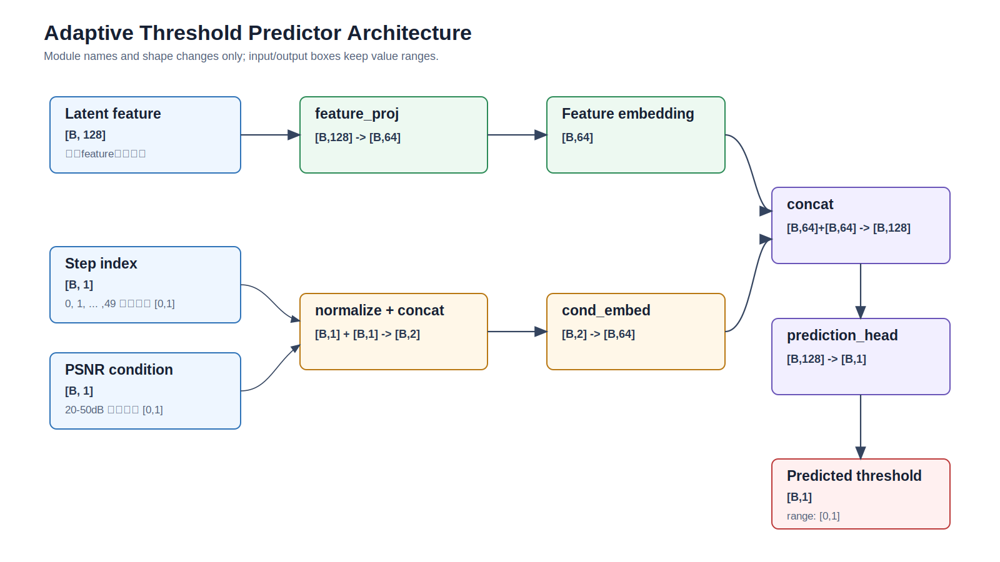

# Wan2.2 自适应阈值网络报告

## 1. 数据准备

### 1.1 数据来源

| 项目 | 内容 |
|---|---|
| 数据根目录 | `/hy-tmp/openvid_100_seacache_trace_data` |
| 训练数据视图 | `/hy-tmp/openvid_100_seacache_trace_data/data` |
| 数据组织方式 | flat symlink view，不需要感知原始 shard/source split |
| Prompt 数量 | `100` |
| SeaCache threshold 数量 | `10` |
| 候选推理数量 | `1000` |
| Baseline 视频数量 | `100` |
| SeaCache 视频数量 | `1000` |
| Step-input 目录数量 | `1100`，其中 baseline `100`，SeaCache `1000` |

数据来自 OpenVid-100 SeaCache trace 归档。每个 sample 有一个 no-cache baseline，并对应 10 个 SeaCache threshold 候选。

### 1.2 Threshold 设置

| threshold_label | threshold |
|---|---:|
| `th_0p10` | `0.10` |
| `th_0p15` | `0.15` |
| `th_0p20` | `0.20` |
| `th_0p25` | `0.25` |
| `th_0p30` | `0.30` |
| `th_0p40` | `0.40` |
| `th_0p50` | `0.50` |
| `th_0p60` | `0.60` |
| `th_0p70` | `0.70` |
| `th_0p80` | `0.80` |

### 1.3 主要数据表

| 文件 | 行数 | 用途 |
|---|---:|---|
| `data/tables/summary.csv` | `1000 + header` | 每行一个 SeaCache 候选推理 |
| `data/tables/summary.jsonl` | `1000` | 与 `summary.csv` 等价的 JSONL 版本 |
| `data/tables/prompts.csv` | `100 + header` | 每行一个 OpenVid prompt/sample |
| `data/tables/prompts.jsonl` | `100` | 与 `prompts.csv` 等价的 JSONL 版本 |
| `data/metadata/manifest.json` | `1` | 数据根目录、候选数量、threshold 列表和路径说明 |

`summary.csv` 主要字段：

| 字段 | 含义 |
|---|---|
| `sample_id` | 稳定样本 ID |
| `prompt` | 文本 prompt |
| `threshold_label` / `threshold` | SeaCache threshold |
| `baseline_elapsed_seconds` | baseline compute elapsed |
| `seacache_elapsed_seconds` | SeaCache candidate compute elapsed |
| `speedup` | `baseline_elapsed_seconds / seacache_elapsed_seconds` |
| `mean_psnr`, `min_psnr`, `max_psnr` | 相对 baseline 的 FFmpeg PSNR |
| `psnr_frames` | 参与 PSNR 统计的帧数 |
| `decoded_frames_total` | 解码帧数 |
| `excluded_perfect_frames` | 被排除的 perfect/Infinity frames |
| `seacache_reuse_count` | timestep reuse 次数 |
| `seacache_recompute_count` | timestep recompute 次数 |
| `seacache_reuse_branch_call_count` | branch-call 级 reuse 次数 |
| `seacache_recompute_branch_call_count` | branch-call 级 recompute 次数 |
| `baseline_video` / `seacache_video` | 视频相对路径 |
| `baseline_log` / `seacache_log` | 原始运行日志相对路径 |
| `baseline_ffprobe_path` / `seacache_ffprobe_path` | ffprobe JSON 相对路径 |
| `psnr_json`, `psnr_log`, `psnr_ffmpeg_log` | PSNR 输出相对路径 |
| `baseline_command` / `seacache_command` | 复现实验命令脚本相对路径 |
| `baseline_step_inputs` / `seacache_step_inputs` | denoising step latent trace 目录 |

### 1.4 文件布局

| 类型 | 路径模板 |
|---|---|
| Baseline 视频 | `data/baseline/videos/<sample_id>.mp4` |
| Baseline 日志 | `data/baseline/logs/<sample_id>.log` |
| Baseline ffprobe | `data/baseline/ffprobe/<sample_id>.json` |
| Baseline 命令 | `data/baseline/commands/<sample_id>.sh` |
| Baseline step inputs | `data/baseline/step_inputs/<sample_id>/` |
| SeaCache 视频 | `data/seacache/videos/th_<threshold>/<sample_id>.mp4` |
| SeaCache 日志 | `data/seacache/logs/th_<threshold>/<sample_id>.log` |
| SeaCache ffprobe | `data/seacache/ffprobe/th_<threshold>/<sample_id>.json` |
| SeaCache PSNR | `data/seacache/psnr/th_<threshold>/<sample_id>.json` |
| SeaCache 命令 | `data/seacache/commands/th_<threshold>/<sample_id>.sh` |
| SeaCache step inputs | `data/seacache/step_inputs/th_<threshold>/<sample_id>/` |

### 1.5 Step Trace 数据

每个 step-input 目录包含：

| 文件 | 内容 |
|---|---|
| `meta.pt` | scheduler timesteps 等元信息 |
| `step_000.pt` ... `step_049.pt` | 50 个 denoising step 的 latent 输入 |

单 step latent tensor：

| 项目 | 值 |
|---|---|
| shape | `[C, T, H, W] = [16, 12, 60, 104]` |
| on-disk dtype | `float16` |
| 训练读取 dtype | 转为 `float32` |
| step 数 | `50` |
| step index 归一化 | `step_index / 49` |

### 1.6 训练样本构造

当前默认数据模式为 `candidate_inverse`。

| 项目 | 内容 |
|---|---|
| 数据集类 | `TraceStepThresholdDataset` |
| 构造函数 | `make_candidate_inverse_examples` |
| 输入 latent | `data/seacache/step_inputs/<threshold_label>/<sample_id>/step_*.pt` |
| 输入条件 1 | `step_index / 49` |
| 输入条件 2 | 当前候选实际达到的 `mean_psnr` |
| 标签 | 当前候选使用的 `threshold` |
| 样本数量 | `100 samples * 10 thresholds * 50 steps = 50000` |

单个训练样本：

| 字段 | shape / 类型 | 来源 |
|---|---|---|
| `sample_id` | string | `summary.csv` |
| `latent` | `[16, 12, 60, 104]` | candidate step trace |
| `timestep` | `[1]` | `step_index / 49` |
| `target_psnr` | `[1]` | candidate `mean_psnr` |
| `threshold` | `[1]` | candidate threshold label |

保留的对照模式：

| 模式 | 输入 | 标签 |
|---|---|---|
| `target_oracle` | baseline latent + step + desired target PSNR | 对该 sample 满足目标 PSNR 的最快 threshold；若不可达则用最高 PSNR threshold |

### 1.7 Train / Validation Split

| 项目 | 设置 |
|---|---|
| 切分方式 | 按 `sample_id` 分组 |
| 默认比例 | `80% / 20%` |
| 默认 seed | `42` |
| train samples | `80` |
| val samples | `20` |
| train examples | `40000` |
| val examples | `10000` |
| sample overlap | `0` |

### 1.8 输入归一化

| 输入 | 归一化 |
|---|---|
| timestep | 已在 dataset 中写成 `step_index / 49`，模型内 clamp 到 `[0, 1]` |
| PSNR | `clamp((target_psnr - psnr_min) / (psnr_max - psnr_min), 0, 1)` |
| `psnr_min` | `10.0` |
| `psnr_max` | `50.0` |
| threshold label | 原始 threshold，范围 `[0.10, 0.80]`，模型输出用 Sigmoid 限制到 `[0, 1]` |

### 1.9 Feature Cache

raw latent 训练需要频繁读取 50,000 个 step `.pt` 文件，因此构建了 pooled feature cache。

| 项目 | 内容 |
|---|---|
| cache root | `/hy-tmp/wan22_adaptive_threshold_feature_cache_candidate_inverse_20260616_012409` |
| dataset mode | `candidate_inverse` |
| examples | `50000` |
| grid size | `2x2x2` |
| feature dim | `16 * 2 * 2 * 2 = 128` |
| dtype | `float32` |
| cache build device | `cuda` |
| cache batch size | `8` |
| cache workers | `4` |
| build elapsed | `300.38 s` |
| cache size | 约 `124M` |

缓存文件：

| 文件 | shape / 内容 |
|---|---|
| `features_latent_pool.pt` | `[50000, 128]` |
| `features_temporal_mean.pt` | `[50000, 128]` |
| `features_temporal_var.pt` | `[50000, 128]` |
| `features_frame_diff_mean.pt` | `[50000, 128]` |
| `features_frame_diff_var.pt` | `[50000, 128]` |
| `metadata.pt` | `sample_id`, `timestep`, `target_psnr`, `threshold`, `step_index`, `source_index` |
| `manifest.json` | cache 配置和统计 |
| `cache_config.json` | cache 构建参数 |

五类 cached feature：

| feature_set | 定义 |
|---|---|
| `latent_pool` | 原 latent 直接 pooled 到 `2x2x2` |
| `temporal_mean` | 先对时间维取均值，再 spatial pool，并扩展到目标 feature 维度 |
| `temporal_var` | 先对时间维取方差，再 spatial pool，并扩展到目标 feature 维度 |
| `frame_diff_mean` | 一阶帧差绝对值的时间均值 |
| `frame_diff_var` | 一阶帧差绝对值的时间方差 |

### 1.10 数据准备验证

| 检查项 | 结果 |
|---|---|
| `summary.csv` candidate rows | `1000` |
| `prompts.csv` prompt rows | `100` |
| baseline video links | `100` |
| SeaCache video links | `1000` |
| PSNR JSON links | `1000` |
| step input links | `1100` |
| broken links under `data/` | `0` |
| `summary.csv` required paths missing | `0` |
| raw latent model smoke test | passed |
| cached feature training path | passed |

一个可忽略的归档缺口：`openvidhd_part1_033` 的 `th_0p10` 缺少可选 PSNR text log 和 ffmpeg log；PSNR JSON 存在，训练表中对应可选字段为空。

## 2. 网络架构

### 2.1 当前任务定义

当前网络用于 timestep / SeaCache threshold 预测。

| 项目 | 内容 |
|---|---|
| 模型名称 | `ImprovedAdaCacheGate` |
| 当前预测目标 | 单个 SeaCache threshold |
| 输出范围 | `[0, 1]` |
| 当前默认标签范围 | `[0.10, 0.80]` |
| 当前默认输入模式 | cached feature + timestep + PSNR |
| 当前默认 feature | `temporal_mean` |
| 当前默认 pooling grid | `2x2x2` |

### 2.2 输入

当前正式训练使用 cached feature 路径；raw latent 路径保留用于对照和调试。

| 输入 | shape | 原始范围 / 类型 | 模型输入值域 | 说明 |
|---|---|---|---|---|
| raw latent | `[B, 16, 12, 60, 104]` | `float16` on disk，读取后转 `float32` | 实数，无固定截断 | raw-latent 路径使用 |
| cached feature | `[B, 128]` | `float32` pooled latent feature | 实数，无固定截断 | 正式训练默认输入 |
| timestep | `[B, 1]` | step index: `0..49` | `[0, 1]` | `step_index / 49` |
| target PSNR | `[B, 1]` | dB，训练表中主要约 `10..50+` | `[0, 1]` after normalize | 当前 `candidate_inverse` 中为候选实际 `mean_psnr` |

PSNR 在模型内归一化：

```text
target_psnr_norm = clamp((target_psnr - 10) / (50 - 10), 0, 1)
```

### 2.3 结构

架构简图：



文字流程图：

```text
cached feature [B,128]
  -> feature_proj: Linear -> SiLU -> Linear -> SiLU
  -> feature embedding [B,64]

(timestep [B,1], PSNR [B,1])
  -> normalize to [0,1]
  -> concat [B,2]
  -> cond_embed: Linear -> SiLU -> Linear -> SiLU
  -> condition embedding [B,64]

feature embedding [B,64] + condition embedding [B,64]
  -> concat [B,128]
  -> predict_head:
       Linear -> LayerNorm -> SiLU -> Dropout
       -> Linear -> SiLU -> Linear -> Sigmoid
  -> threshold prediction [B,1]
```

网络由 feature branch 和 condition branch 组成，最后 concat 后预测 threshold。

| 分支 | 输入 | 结构 | 输出维度 |
|---|---|---|---:|
| feature branch | latent-derived feature | Linear -> SiLU -> Linear -> SiLU | `64` |
| condition branch | timestep + PSNR | Linear -> SiLU -> Linear -> SiLU | `64` |
| prediction head | concat 后的 128 维特征 | Linear -> LayerNorm -> SiLU -> Dropout -> Linear -> SiLU -> Linear -> Sigmoid | `1` |

默认参数量：

| 设置 | 参数量 |
|---|---:|
| cached/raw feature model, `2x2x2`, `hidden_dim=64` | `29377` |
| condition-only control | `12865` |

### 2.4 输出

| 输出 | shape | 值域 | 说明 |
|---|---|---|---|
| predicted threshold | `[B, 1]` | `[0, 1]` | Sigmoid 输出 |
| 训练标签 threshold | `[B, 1]` | 当前为 `[0.10, 0.80]` | 来自 SeaCache sweep 的实际 threshold |

输出直接作为 timestep / SeaCache cache threshold 的预测值。当前训练数据只覆盖 `0.10..0.80`，因此实际可信区间也主要在该范围内。

### 2.5 Latent-derived Feature

raw-latent 模式中，模型内部先提取 feature，再池化到固定大小。cached-feature 模式中，这一步已提前离线完成。

| feature_set | 特征定义 |
|---|---|
| `latent_pool` | 原 latent 直接 adaptive average pool |
| `temporal_mean` | 时间维均值 |
| `temporal_var` | 时间维方差 |
| `frame_diff_mean` | 相邻帧 latent 绝对差的时间均值 |
| `frame_diff_var` | 相邻帧 latent 绝对差的时间方差 |

默认缓存使用：

```text
AdaptiveAvgPool3d((2, 2, 2))
feature_dim = 16 * 2 * 2 * 2 = 128
```

### 2.6 Cached-feature 模型

正式训练主要使用 `CachedFeatureAdaCacheGate`，避免训练时重复读取和池化 raw latent。

| 模块 | 输入 | 输出 |
|---|---|---|
| `feature_proj` | `[B, 128]` | `[B, 64]` |
| `cond_embed` | `[B, 2]` | `[B, 64]` |
| `predict_head` | `[B, 128]` | `[B, 1]` |

该模型与 raw-latent 版本共享同样的 condition branch 和 prediction head 设计，只是把 feature extraction 移到离线 cache 构建阶段。

### 2.7 参数量

| 配置 | feature dim | hidden dim | 参数量 |
|---|---:|---:|---:|
| `2x2x2` feature model | `128` | `64` | `29377` |
| `2x4x4` feature model | `512` | `64` | `53953` |
| `3x4x4` feature model | `768` | `64` | `70337` |
| `4x4x4` feature model | `1024` | `64` | `86721` |
| condition-only control | - | `64` | `12865` |

当前默认采用 `2x2x2 temporal_mean`，参数量 `29377`。

### 2.8 Control Models

| control mode | 作用 |
|---|---|
| `feature` | 使用真实 latent-derived feature |
| `condition_only` | 只使用 timestep 和 PSNR |
| `noise_feature` | 保留 feature branch，但输入随机噪声 |

这些 control 用于判断 latent feature 是否提供额外信息。

### 2.9 当前默认配置

| 项目 | 默认值 |
|---|---|
| 模型 | `CachedFeatureAdaCacheGate` |
| feature_set | `temporal_mean` |
| grid_size | `2x2x2` |
| feature_dim | `128` |
| hidden_dim | `64` |
| condition inputs | normalized timestep, normalized PSNR |
| loss | SmoothL1Loss |
| optimizer | AdamW |
| output activation | Sigmoid |

## 3. Ablation 结果汇总

### 3.1 Feature 训练结果

设置：`candidate_inverse`，`2x2x2` pooled feature，`hidden_dim=64`，3 epochs，按 `sample_id` 分组切分。

| 输入设置 | feature dim | 参数量 | best epoch | best train loss | best val loss | best val MAE | last val loss | last val MAE |
|---|---:|---:|---:|---:|---:|---:|---:|---:|
| `temporal_mean` | 128 | 29377 | 2 | 0.008699 | 0.012259 | 0.120107 | 0.013371 | 0.124634 |
| `latent_pool` | 128 | 29377 | 2 | 0.008435 | 0.012755 | 0.116558 | 0.014755 | 0.121741 |
| `frame_diff_mean` | 128 | 29377 | 3 | 0.010408 | 0.014569 | 0.132957 | 0.014569 | 0.132957 |
| `temporal_var` | 128 | 29377 | 1 | 0.012165 | 0.014595 | 0.129695 | 0.014773 | 0.129323 |
| `frame_diff_var` | 128 | 29377 | 2 | 0.010434 | 0.014659 | 0.131198 | 0.014911 | 0.128066 |
| `noise_feature` | 128 | 29377 | 1 | 0.013044 | 0.014648 | 0.131173 | 0.014707 | 0.129549 |
| `condition_only` | - | 12865 | 3 | 0.010419 | 0.014652 | 0.128916 | 0.014652 | 0.128916 |

当前 loss-based 最好结果是 `temporal_mean`；`latent_pool` 的 best val MAE 更低，但 best val loss 略高。

### 3.2 Pooling Size 训练结果

设置：`candidate_inverse`，五种 feature，`hidden_dim=64`，3 epochs，按 `sample_id` 分组切分。

| pooling size | feature dim | feature | 参数量 | best epoch | best train loss | best val loss | best val MAE | last val loss | last val MAE |
|---|---:|---|---:|---:|---:|---:|---:|---:|---:|
| `2x2x2` | 128 | `temporal_mean` | 29377 | 2 | 0.008699 | 0.012259 | 0.120107 | 0.013371 | 0.124634 |
| `2x2x2` | 128 | `latent_pool` | 29377 | 2 | 0.008435 | 0.012755 | 0.116558 | 0.014755 | 0.121741 |
| `2x2x2` | 128 | `frame_diff_mean` | 29377 | 3 | 0.010408 | 0.014569 | 0.132957 | 0.014569 | 0.132957 |
| `2x2x2` | 128 | `temporal_var` | 29377 | 1 | 0.012165 | 0.014595 | 0.129695 | 0.014773 | 0.129323 |
| `2x2x2` | 128 | `frame_diff_var` | 29377 | 2 | 0.010434 | 0.014659 | 0.131198 | 0.014911 | 0.128066 |
| `2x4x4` | 512 | `latent_pool` | 53953 | 1 | 0.010877 | 0.012434 | 0.118093 | 0.016158 | 0.130340 |
| `2x4x4` | 512 | `temporal_mean` | 53953 | 1 | 0.010793 | 0.013368 | 0.120277 | 0.015199 | 0.126291 |
| `2x4x4` | 512 | `frame_diff_var` | 53953 | 3 | 0.010378 | 0.014491 | 0.131235 | 0.014491 | 0.131235 |
| `2x4x4` | 512 | `temporal_var` | 53953 | 3 | 0.010393 | 0.014567 | 0.129576 | 0.014567 | 0.129576 |
| `2x4x4` | 512 | `frame_diff_mean` | 53953 | 2 | 0.010414 | 0.014630 | 0.129683 | 0.014736 | 0.128836 |
| `3x4x4` | 768 | `temporal_mean` | 70337 | 1 | 0.010796 | 0.013236 | 0.124000 | 0.015243 | 0.126634 |
| `3x4x4` | 768 | `latent_pool` | 70337 | 1 | 0.011089 | 0.013909 | 0.121416 | 0.015346 | 0.126731 |
| `3x4x4` | 768 | `frame_diff_var` | 70337 | 3 | 0.010369 | 0.014519 | 0.128593 | 0.014519 | 0.128593 |
| `3x4x4` | 768 | `frame_diff_mean` | 70337 | 3 | 0.010407 | 0.014545 | 0.128772 | 0.014545 | 0.128772 |
| `3x4x4` | 768 | `temporal_var` | 70337 | 3 | 0.010430 | 0.014718 | 0.128338 | 0.014718 | 0.128338 |
| `4x4x4` | 1024 | `latent_pool` | 86721 | 1 | 0.010894 | 0.012733 | 0.118652 | 0.016058 | 0.128290 |
| `4x4x4` | 1024 | `temporal_mean` | 86721 | 1 | 0.010684 | 0.014222 | 0.122172 | 0.015309 | 0.127811 |
| `4x4x4` | 1024 | `frame_diff_var` | 86721 | 2 | 0.010522 | 0.014577 | 0.130000 | 0.014607 | 0.131053 |
| `4x4x4` | 1024 | `temporal_var` | 86721 | 3 | 0.010400 | 0.014705 | 0.128684 | 0.014705 | 0.128684 |
| `4x4x4` | 1024 | `frame_diff_mean` | 86721 | 2 | 0.010455 | 0.014745 | 0.129399 | 0.014964 | 0.129430 |

按 best val loss 排序，整体最优仍是 `2x2x2 temporal_mean`。更大的 pooling size 没有带来更低的 validation loss，并且更容易在第 1 个 epoch 后出现 validation loss 上升。
