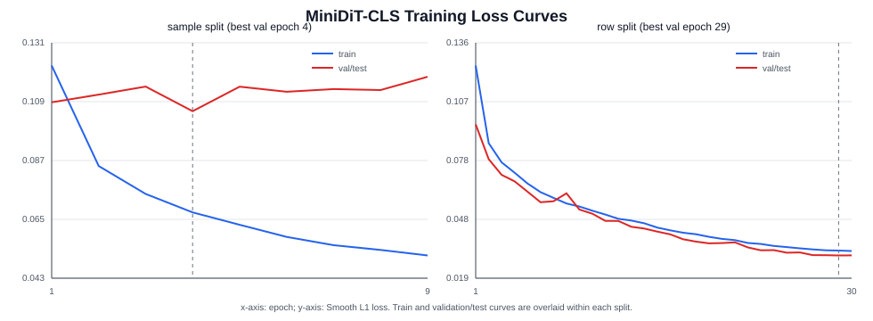
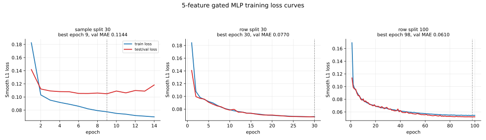

# MiniDiT vs 5-Feature Gated MLP Predictor Comparison

Date: 2026-06-30

## 1. Scope

This report isolates the comparison between two adaptive SeaCache threshold predictors:

- MiniDiT-CLS Transformer predictor;
- 5-feature gated MLP predictor.

It includes training loss data and figures for both methods, then compares their real online Wan2.2 T2V inference performance under the same 24-candidate protocol.

## 2. Method Summary

| Method | Parameters | Input | Core architecture | Output mapping |
| --- | --- | --- | --- | --- |
| MiniDiT-CLS Transformer | `724,513` | raw latent `[16,12,60,104]` | Conv3d patch tokens + CLS Transformer | `0.10 + sigmoid(raw) * 0.70` |
| 5-feature gated MLP | `83,526` | five pooled features, each `128` dim | per-feature MLP encoders + condition softmax gate | `0.10 + sigmoid(raw) * 0.70` |

## 3. Training Loss Data

The table below reports the best validation/test epoch for each training run and the final validation/test MAE. Row split is easier than sample split because train and validation/test rows share source-video identities.

| Run | Model type | Split | Epochs run | Best epoch | Train loss | Train MAE | Test loss | Test MAE | Final test MAE |
| --- | --- | --- | --- | --- | --- | --- | --- | --- | --- |
| MiniDiT sample split 30 | mini_dit_cls | sample | 9 / 30 | 4 | `0.067382` | `0.076298` | `0.105273` | `0.114459` | `0.127152` |
| MiniDiT row split 30 | mini_dit_cls | row | 30 / 30 | 29 | `0.032757` | `0.040767` | `0.030339` | `0.038002` | `0.038097` |
| 5-feature MLP sample split 30 | mlp | sample | 14 / 30 | 9 | `0.077537` | `0.086933` | `0.104928` | `0.114357` | `0.127830` |
| 5-feature MLP row split 30 | mlp | row | 30 / 30 | 30 | `0.068333` | `0.077565` | `0.067842` | `0.077050` | `0.077050` |
| 5-feature MLP row split 100 | mlp | row | 100 / 100 | 98 | `0.054622` | `0.063460` | `0.052242` | `0.061031` | `0.061050` |

### 3.1 Online-Checkpoint Training Comparison

The online comparison uses MiniDiT sample/row checkpoints and 5-feature sample/row checkpoints. For 5-feature row split, the online run uses the stronger 100-epoch checkpoint.

| Checkpoint role | Method | Best test loss | Best test MAE | Best epoch | Training directory |
| --- | --- | --- | --- | --- | --- |
| sample split online checkpoint | MiniDiT | `0.105273` | `0.114459` | epoch 4 | /hy-tmp/wan22_adaptive_threshold_mini_dit_cls_convpatch_3x12x8_d96_l2_bs128_20260629_214906 |
| sample split online checkpoint | 5-feature MLP | `0.104928` | `0.114357` | epoch 9 | /hy-tmp/wan22_adaptive_threshold_mlp_gated_5feature_range_samplesplit_20260630_035000 |
| row split online checkpoint | MiniDiT | `0.030339` | `0.038002` | epoch 29 | /hy-tmp/wan22_adaptive_threshold_mini_dit_cls_convpatch_rowsplit_packed_d96_l2_bs128_20260629_232659 |
| row split online checkpoint | 5-feature MLP | `0.052242` | `0.061031` | epoch 98 | /hy-tmp/wan22_adaptive_threshold_mlp_gated_5feature_range_rowsplit_gpu_long100_20260630_035000 |

## 4. Training Loss Figures

MiniDiT training curves:

5-feature gated MLP training curves:

The MiniDiT row split has the strongest offline validation/test MAE (`0.038002`). The 5-feature MLP sample split is essentially tied with MiniDiT sample split offline (`0.114357` vs `0.114459`), while the 5-feature row split remains worse than MiniDiT row split even after 100 epochs (`0.061031` vs `0.038002`).

## 5. Online Inference Protocol

Both methods are compared using the same online adaptive SeaCache protocol:

| Item | Value |
|---|---:|
| task | `t2v-A14B` |
| checkpoint | `/hy-tmp/models/Wan2.2-T2V-A14B` |
| size | `832*480` |
| frame count | `45` |
| sample steps | `50` |
| solver | `dpm++` |
| seed | `42` |
| baseline policy | reuse existing no-cache baseline |
| quality metric | FFmpeg PSNR against same prompt/seed/shape baseline |
| speed metric | `inference_compute_elapsed_seconds` |
| candidate grid | `2 splits * 2 target PSNRs * 2 datasets * 3 prompts = 24` |
| splits | `sample_split`, `row_split` |
| target PSNRs | `22`, `28` |
| VBench10 prompts | `vbench10_001`, `vbench10_002`, `vbench10_003` |
| OpenVid train prompts | `openvid_002`, `openvid_004`, `openvid_005` |

Result roots:

| Method | Result root |
|---|---|
| MiniDiT | `/hy-tmp/wan22_adaptive_seacache_mini_dit_split_compare_50step_45f_480p_20260630_025328` |
| 5-feature gated MLP | `/hy-tmp/wan22_adaptive_seacache_mlp_gated_5feature_range_split_compare_50step_45f_480p_20260630_050727` |

## 6. Online Aggregate Comparison

Positive speed delta means the 5-feature MLP is faster. Positive PSNR delta means the 5-feature MLP has higher PSNR.

| dataset | split | target | 5-feature speedup | MiniDiT speedup | speed delta | 5-feature PSNR | MiniDiT PSNR | PSNR delta | 5-feature target err | MiniDiT target err | 5-feature threshold | MiniDiT threshold |
| --- | --- | --- | --- | --- | --- | --- | --- | --- | --- | --- | --- | --- |
| openvid100_train | row_split | 22 | 2.523x | 2.447x | +0.077x | 21.970 | 23.007 | -1.037 | -0.030 | +1.007 | 0.488 | 0.484 |
| openvid100_train | row_split | 28 | 1.773x | 1.633x | +0.140x | 26.095 | 27.710 | -1.614 | -1.905 | -0.290 | 0.279 | 0.232 |
| openvid100_train | sample_split | 22 | 2.559x | 2.598x | -0.039x | 22.858 | 22.151 | +0.706 | +0.858 | +0.151 | 0.495 | 0.487 |
| openvid100_train | sample_split | 28 | 1.718x | 1.794x | -0.076x | 27.365 | 29.019 | -1.654 | -0.635 | +1.019 | 0.291 | 0.252 |
| vbench10 | row_split | 22 | 2.065x | 2.068x | -0.003x | 20.810 | 20.466 | +0.344 | -1.190 | -1.534 | 0.353 | 0.329 |
| vbench10 | row_split | 28 | 1.627x | 1.539x | +0.088x | 24.484 | 25.469 | -0.984 | -3.516 | -2.531 | 0.201 | 0.178 |
| vbench10 | sample_split | 22 | 2.229x | 2.113x | +0.116x | 17.159 | 16.737 | +0.422 | -4.841 | -5.263 | 0.358 | 0.359 |
| vbench10 | sample_split | 28 | 1.539x | 1.582x | -0.043x | 25.460 | 23.796 | +1.664 | -2.540 | -4.204 | 0.184 | 0.211 |

## 7. Online Per-Prompt Comparison

| dataset | prompt | split | target | 5-feature speedup | MiniDiT speedup | speed delta | 5-feature PSNR | MiniDiT PSNR | PSNR delta | 5-feature reuse | MiniDiT reuse | 5-feature threshold | MiniDiT threshold |
| --- | --- | --- | --- | --- | --- | --- | --- | --- | --- | --- | --- | --- | --- |
| vbench10 | vbench10_001 | sample_split | 22 | 2.031x | 1.895x | +0.135x | 15.340 | 14.928 | +0.412 | 54 | 50 | 0.301 | 0.273 |
| vbench10 | vbench10_001 | sample_split | 28 | 1.497x | 1.624x | -0.127x | 21.195 | 20.288 | +0.908 | 34 | 40 | 0.173 | 0.204 |
| vbench10 | vbench10_001 | row_split | 22 | 1.965x | 1.904x | +0.062x | 19.906 | 20.087 | -0.181 | 52 | 50 | 0.293 | 0.274 |
| vbench10 | vbench10_001 | row_split | 28 | 1.672x | 1.579x | +0.093x | 20.314 | 20.520 | -0.206 | 42 | 38 | 0.208 | 0.182 |
| vbench10 | vbench10_002 | sample_split | 22 | 2.501x | 2.619x | -0.118x | 20.878 | 19.902 | +0.976 | 64 | 66 | 0.423 | 0.486 |
| vbench10 | vbench10_002 | sample_split | 28 | 1.582x | 1.841x | -0.258x | 32.047 | 30.840 | +1.208 | 38 | 48 | 0.192 | 0.247 |
| vbench10 | vbench10_002 | row_split | 22 | 2.745x | 2.497x | +0.248x | 20.815 | 20.747 | +0.068 | 68 | 64 | 0.533 | 0.442 |
| vbench10 | vbench10_002 | row_split | 28 | 1.844x | 1.630x | +0.214x | 30.000 | 31.898 | -1.897 | 48 | 40 | 0.239 | 0.197 |
| vbench10 | vbench10_003 | sample_split | 22 | 2.204x | 1.960x | +0.244x | 15.259 | 15.380 | -0.120 | 58 | 54 | 0.350 | 0.317 |
| vbench10 | vbench10_003 | sample_split | 28 | 1.539x | 1.356x | +0.183x | 23.137 | 20.260 | +2.877 | 36 | 38 | 0.187 | 0.182 |
| vbench10 | vbench10_003 | row_split | 22 | 1.726x | 1.906x | -0.180x | 21.708 | 20.564 | +1.145 | 44 | 50 | 0.233 | 0.271 |
| vbench10 | vbench10_003 | row_split | 28 | 1.422x | 1.423x | -0.001x | 23.139 | 23.989 | -0.850 | 30 | 30 | 0.157 | 0.155 |
| openvid100_train | openvid_002 | sample_split | 22 | 2.379x | 2.484x | -0.106x | 22.844 | 20.213 | +2.631 | 62 | 64 | 0.415 | 0.444 |
| openvid100_train | openvid_002 | sample_split | 28 | 1.490x | 1.722x | -0.232x | 29.690 | 27.956 | +1.734 | 34 | 44 | 0.169 | 0.217 |
| openvid100_train | openvid_002 | row_split | 22 | 2.282x | 2.281x | +0.002x | 20.637 | 23.404 | -2.767 | 60 | 60 | 0.371 | 0.379 |
| openvid100_train | openvid_002 | row_split | 28 | 1.532x | 1.530x | +0.003x | 28.916 | 28.916 | +0.000 | 36 | 36 | 0.193 | 0.193 |
| openvid100_train | openvid_004 | sample_split | 22 | 3.019x | 3.022x | -0.003x | 24.290 | 24.902 | -0.611 | 72 | 72 | 0.688 | 0.641 |
| openvid100_train | openvid_004 | sample_split | 28 | 2.598x | 2.104x | +0.495x | 27.842 | 33.996 | -6.154 | 66 | 56 | 0.539 | 0.338 |
| openvid100_train | openvid_004 | row_split | 22 | 3.200x | 3.194x | +0.006x | 22.975 | 24.160 | -1.185 | 74 | 74 | 0.741 | 0.743 |
| openvid100_train | openvid_004 | row_split | 28 | 2.728x | 2.191x | +0.537x | 24.810 | 28.196 | -3.386 | 68 | 58 | 0.473 | 0.346 |
| openvid100_train | openvid_005 | sample_split | 22 | 2.378x | 2.375x | +0.003x | 21.439 | 21.339 | +0.100 | 62 | 62 | 0.382 | 0.375 |
| openvid100_train | openvid_005 | sample_split | 28 | 1.448x | 1.623x | -0.174x | 24.563 | 25.104 | -0.542 | 32 | 40 | 0.165 | 0.203 |
| openvid100_train | openvid_005 | row_split | 22 | 2.283x | 2.108x | +0.175x | 22.299 | 21.457 | +0.841 | 60 | 56 | 0.352 | 0.331 |
| openvid100_train | openvid_005 | row_split | 28 | 1.487x | 1.376x | +0.111x | 24.560 | 26.018 | -1.458 | 34 | 28 | 0.172 | 0.156 |

## 8. Findings

1. Offline, MiniDiT is clearly stronger on row split (`0.038002` test MAE) than the 5-feature MLP even with 100 epochs (`0.061031` test MAE). On sample split, both models are essentially tied around `0.114` test MAE.

2. Online, stronger offline row-split MAE does not translate into uniform dominance. 5-feature MLP is faster in several aggregate cells, while MiniDiT often has better OpenVid target-28 PSNR.

3. OpenVid train target 28 favors MiniDiT in PSNR: sample split MiniDiT is `+1.654 dB` over 5-feature MLP, and row split MiniDiT is `+1.614 dB` over 5-feature MLP.

4. VBench10 is mixed. 5-feature MLP is better on sample-split target 28 by `+1.664 dB`, while MiniDiT is better on row-split target 28 by `+0.984 dB`.

5. Both methods still show weak target control on VBench10, especially target 22 under sample split. This supports the current diagnosis that the `candidate_inverse` offline task is not yet well aligned with online adaptive target-quality control.

## 9. Artifacts

| Artifact | Path |
|---|---|
| MiniDiT comprehensive report | `reports/report_mini_dit_transformer_predictor_comprehensive_20260630.md` |
| 5-feature comprehensive report | `reports/report_gated_multifeature_mlp_predictor_comprehensive_20260630.md` |
| MiniDiT loss figure | `reports/assets/mini_dit_cls_training_loss_curves.svg` |
| 5-feature MLP loss figure | `reports/assets/gated_multifeature_mlp_training_loss_curves.svg` |
| MiniDiT online summary | `/hy-tmp/wan22_adaptive_seacache_mini_dit_split_compare_50step_45f_480p_20260630_025328/results/summary.csv` |
| MiniDiT online aggregate | `/hy-tmp/wan22_adaptive_seacache_mini_dit_split_compare_50step_45f_480p_20260630_025328/results/aggregate_by_dataset_model_target.csv` |
| 5-feature online summary | `/hy-tmp/wan22_adaptive_seacache_mlp_gated_5feature_range_split_compare_50step_45f_480p_20260630_050727/results/summary.csv` |
| 5-feature online aggregate | `/hy-tmp/wan22_adaptive_seacache_mlp_gated_5feature_range_split_compare_50step_45f_480p_20260630_050727/results/aggregate_by_dataset_model_target.csv` |
