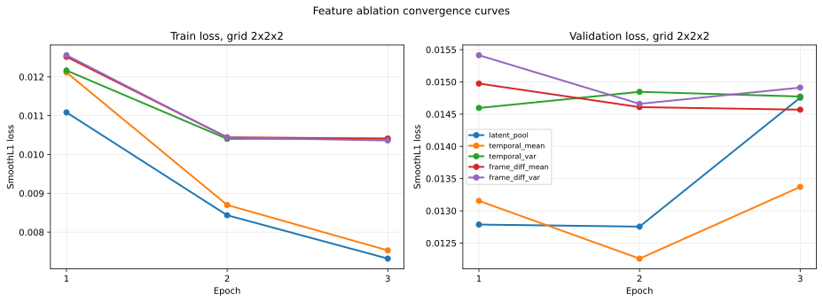
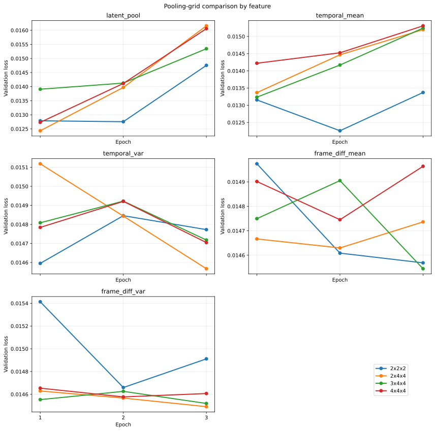
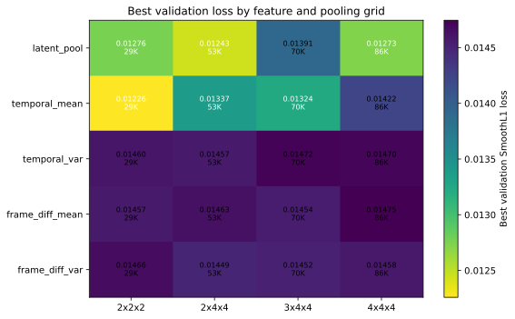
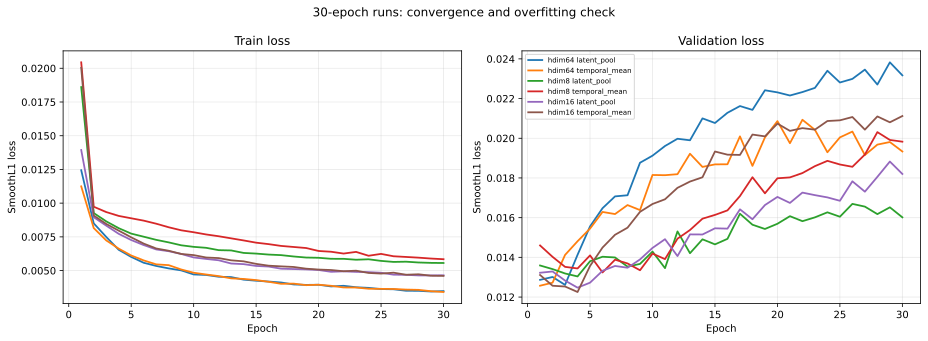

# Adaptive Threshold Predictor Feature/Grid Training Report

## 摘要

本报告合并自适应 timestep threshold 预测网络的实验配置、训练收敛曲线、不同 latent-derived feature / pooling grid 的定量对比，以及当前实验结论。

核心结论：

1. 3-epoch feature/grid ablation 中，最优组合是 `2x2x2 temporal_mean`，best validation loss 为 `0.012259`。
2. 扩大 pooling grid 没有提升全局最优 validation loss。`2x4x4 latent_pool` 接近，但参数更多，且过拟合更快。
3. `temporal_mean` 和 `latent_pool` 明显优于 no-feature / noise-feature baseline，说明 latent-derived feature 确实提供了额外有效信息。
4. 方差类和帧差类 feature 在当前 `candidate_inverse` 标签设定下接近 baseline，暂时不是关键因素。
5. 30-epoch 曲线显示 validation optimum 很早出现，之后 train loss 继续下降但 validation loss 恶化，因此当前训练应使用 early stopping，而不是认为固定 3 epoch 已经“完全收敛”。
6. `hdim16 temporal_mean` 达到 best validation loss `0.012254`，与 hdim64 基本持平，但参数量只有 `3505`，后续轻量化主线建议优先验证 `hdim16 + temporal_mean + 2x2x2`。

## 实验任务

当前训练采用 `candidate_inverse` 形式：

| 项目 | 设置 |
| --- | --- |
| 输入 | 当前 denoising step、当前 step 的 latent-derived feature、候选视频达到的 PSNR |
| 输出 | 该候选运行实际使用的 SeaCache threshold，范围 `[0, 1]` |
| 样本构造 | 每个 sample、每个 SeaCache threshold candidate、每个 denoising step 生成一条训练样本 |
| 数据量 | `100 samples * 10 thresholds * 50 steps = 50000` examples |
| split | 按 `sample_id` 分组，`80` train samples / `20` validation samples |
| train examples | `40000` |
| validation examples | `10000` |
| timestep 归一化 | `step_index / 49` |
| PSNR 归一化 | `clamp((psnr - 10) / (50 - 10), 0, 1)` |
| loss | `SmoothL1Loss` |

注意：本文中的 validation set 是模型选择用的 holdout validation，不是最终 test set。由于我们已经根据 validation loss 选择 feature、grid 和 hidden dim，最终泛化性能仍需要独立 test split 或 grouped K-fold 验证。

## 模型结构

缓存 feature 训练使用同一套轻量 MLP trunk。不同 feature/grid 只改变输入 feature 的内容和维度，条件分支和预测头保持一致。

| 模块 | 配置 |
| --- | --- |
| feature input | 预计算 latent-derived feature，shape `[B, feature_dim]` |
| feature projector | `Linear(feature_dim, hidden_dim) -> SiLU -> Linear(hidden_dim, hidden_dim) -> SiLU` |
| condition input | `[normalized_timestep, normalized_psnr]` |
| condition embed | `Linear(2, hidden_dim) -> SiLU -> Linear(hidden_dim, hidden_dim) -> SiLU` |
| fusion | concat feature embedding 和 condition embedding，维度 `2 * hidden_dim` |
| prediction head | `Linear(2H,H) -> LayerNorm -> SiLU -> Dropout -> Linear(H,H) -> SiLU -> Linear(H,1) -> Sigmoid` |
| 输出 | 单个 threshold，范围 `[0, 1]` |

默认 3-epoch ablation 使用 `hidden_dim=64`。长训补充实验额外比较了 `hidden_dim=8/16/64`。

## Feature 定义

| feature | 定义 | 直觉 |
| --- | --- | --- |
| `latent_pool` | 对原始 latent 做 `AdaptiveAvgPool3d(grid)` 后 flatten | 保留粗粒度时空分布 |
| `temporal_mean` | 先沿时间维求均值，再扩展回时序体并做 3D pooling | 描述当前 latent 的静态内容强度 |
| `temporal_var` | 先沿时间维求方差，再扩展回时序体并做 3D pooling | 描述时序波动程度 |
| `frame_diff_mean` | 相邻帧一阶绝对差分后，沿时间维求均值，再 pooling | 描述平均动态变化 |
| `frame_diff_var` | 相邻帧一阶绝对差分后，沿时间维求方差，再 pooling | 描述动态变化的不稳定性 |

## Grid 与参数量

`latent_channels=16` 时，不同 pooling grid 对 feature 维度和模型参数量的影响如下：

| grid | pooled cells | feature dim | hidden dim | parameters |
| --- | ---: | ---: | ---: | ---: |
| `2x2x2` | 8 | 128 | 64 | 29377 |
| `2x4x4` | 32 | 512 | 64 | 53953 |
| `3x4x4` | 48 | 768 | 64 | 70337 |
| `4x4x4` | 64 | 1024 | 64 | 86721 |

扩大 grid 会增加输入信息容量，但也线性增加 feature projector 的参数量。在当前数据规模下，较大 grid 更早出现 validation loss 回升。

## 训练配置

| 配置项 | 3-epoch feature/grid ablation | 30-epoch convergence check |
| --- | --- | --- |
| dataset mode | `candidate_inverse` | `candidate_inverse` |
| optimizer | AdamW | AdamW |
| learning rate | `1e-3` | `1e-3` |
| weight decay | `1e-4` | `1e-4` |
| batch size | `256` | `256` |
| epochs | `3` | `30` |
| split seed | `42` | `42` |
| split method | group by `sample_id` | group by `sample_id` |
| train/val examples | `40000 / 10000` | `40000 / 10000` |
| saved artifacts | `config.json`, `split.json`, `metrics.json`, `best_model.pt`, `final_model.pt`, `val_predictions.csv` | 同左 |

## Control Baseline 配置

| control | 配置 | 目的 |
| --- | --- | --- |
| `condition_only` | 移除 feature branch，只输入 timestep + PSNR | 衡量条件变量本身能解释多少 threshold label |
| `noise_feature` | 保留 feature projector 和预测 trunk，但 feature 输入替换为随机噪声 | 排除“参数量/结构”本身带来的虚假收益 |

`noise_feature` 的参数量与 `2x2x2` feature 模型相同，都是 `29377`；`condition_only` 参数量为 `12865`。

## 结果来源

主要训练结果来自以下归档目录：

| 用途 | 目录 |
| --- | --- |
| `2x2x2` feature ablation | `/hy-tmp/wan22_adaptive_threshold_feature_ablation_cached_20260616_012409` |
| larger grid ablation | `/hy-tmp/wan22_adaptive_threshold_grid_ablation_20260616_020314` |
| no-feature / noise controls | `/hy-tmp/wan22_adaptive_threshold_controls_20260616` |
| 30-epoch long runs | `/hy-tmp/wan22_adaptive_threshold_feature_ablation_long_20260616` |
| hdim 8 / 16 long runs | `/hy-tmp/wan22_adaptive_threshold_feature_ablation_hdim8_20260616`, `/hy-tmp/wan22_adaptive_threshold_feature_ablation_hdim16_20260616` |

图、表和本文中的 summary 数字由以下脚本统一生成：

```bash
/hy-tmp/miniconda3/envs/Wan2.2/bin/python -m experiments.adaptive_threshold_predictor.plot_training_curves \
  --out_dir reports/assets/adaptive_training_curves
```

输出文件：

- `reports/assets/adaptive_training_curves/training_curve_summary.csv`
- `reports/assets/adaptive_training_curves/training_curve_summary.json`
- `reports/assets/adaptive_training_curves/feature_curves_2x2x2.svg`
- `reports/assets/adaptive_training_curves/grid_val_curves_by_feature.svg`
- `reports/assets/adaptive_training_curves/best_val_loss_heatmap.svg`
- `reports/assets/adaptive_training_curves/long_run_curves.svg`

## 图表总览

| 图 | 内容 |
| --- | --- |
| `feature_curves_2x2x2.svg` | `2x2x2` 下五个 feature 的 train/validation loss 曲线 |
| `grid_val_curves_by_feature.svg` | 每个 feature 在四个 pooling grid 下的 validation loss 曲线 |
| `best_val_loss_heatmap.svg` | feature × grid 的 best validation loss 热图，并标注参数量 |
| `long_run_curves.svg` | hdim8/16/64 的 30-epoch train/validation loss 曲线 |

## 不同 Feature 的 2x2x2 曲线



`2x2x2` grid 下，五个 feature 的 best validation loss 排名如下：

| rank | feature | params | best epoch | best val loss | best val MAE | last val loss |
| ---: | --- | ---: | ---: | ---: | ---: | ---: |
| 1 | `temporal_mean` | 29377 | 2 | 0.012259 | 0.120107 | 0.013371 |
| 2 | `latent_pool` | 29377 | 2 | 0.012755 | 0.116558 | 0.014755 |
| 3 | `frame_diff_mean` | 29377 | 3 | 0.014569 | 0.132957 | 0.014569 |
| 4 | `temporal_var` | 29377 | 1 | 0.014595 | 0.129695 | 0.014773 |
| 5 | `frame_diff_var` | 29377 | 2 | 0.014659 | 0.131198 | 0.014911 |

观察：

- `temporal_mean` 的 validation loss 最低，当前是 loss-based 最优 feature。
- `latent_pool` 的 validation MAE 最低，但 validation loss 略高于 `temporal_mean`。
- 方差类和帧差类 feature 明显弱于 `temporal_mean / latent_pool`，与 no-feature control 接近。
- `temporal_mean` 和 `latent_pool` 在第 2 epoch 达到最好 validation loss，第 3 epoch train loss 继续下降但 val loss 上升，说明短训阶段已经出现过拟合趋势。

## 不同 Grid 的 Validation 曲线



下表列出 3-epoch grid ablation 的全量 best validation loss 排名：

| rank | grid | feature | params | best epoch | best val loss | best val MAE | last val loss |
| ---: | --- | --- | ---: | ---: | ---: | ---: | ---: |
| 1 | `2x2x2` | `temporal_mean` | 29377 | 2 | 0.012259 | 0.120107 | 0.013371 |
| 2 | `2x4x4` | `latent_pool` | 53953 | 1 | 0.012434 | 0.118093 | 0.016158 |
| 3 | `4x4x4` | `latent_pool` | 86721 | 1 | 0.012733 | 0.118652 | 0.016058 |
| 4 | `2x2x2` | `latent_pool` | 29377 | 2 | 0.012755 | 0.116558 | 0.014755 |
| 5 | `3x4x4` | `temporal_mean` | 70337 | 1 | 0.013236 | 0.124000 | 0.015243 |
| 6 | `2x4x4` | `temporal_mean` | 53953 | 1 | 0.013368 | 0.120277 | 0.015199 |
| 7 | `3x4x4` | `latent_pool` | 70337 | 1 | 0.013909 | 0.121416 | 0.015346 |
| 8 | `4x4x4` | `temporal_mean` | 86721 | 1 | 0.014222 | 0.122172 | 0.015309 |
| 9 | `2x4x4` | `frame_diff_var` | 53953 | 3 | 0.014491 | 0.131235 | 0.014491 |
| 10 | `3x4x4` | `frame_diff_var` | 70337 | 3 | 0.014519 | 0.128593 | 0.014519 |
| 11 | `3x4x4` | `frame_diff_mean` | 70337 | 3 | 0.014545 | 0.128772 | 0.014545 |
| 12 | `2x4x4` | `temporal_var` | 53953 | 3 | 0.014567 | 0.129576 | 0.014567 |
| 13 | `2x2x2` | `frame_diff_mean` | 29377 | 3 | 0.014569 | 0.132957 | 0.014569 |
| 14 | `4x4x4` | `frame_diff_var` | 86721 | 2 | 0.014577 | 0.130000 | 0.014607 |
| 15 | `2x2x2` | `temporal_var` | 29377 | 1 | 0.014595 | 0.129695 | 0.014773 |
| 16 | `2x4x4` | `frame_diff_mean` | 53953 | 2 | 0.014630 | 0.129683 | 0.014736 |
| 17 | `2x2x2` | `frame_diff_var` | 29377 | 2 | 0.014659 | 0.131198 | 0.014911 |
| 18 | `4x4x4` | `temporal_var` | 86721 | 3 | 0.014705 | 0.128684 | 0.014705 |
| 19 | `3x4x4` | `temporal_var` | 70337 | 3 | 0.014718 | 0.128338 | 0.014718 |
| 20 | `4x4x4` | `frame_diff_mean` | 86721 | 2 | 0.014745 | 0.129399 | 0.014964 |

观察：

- 扩大 grid 没有带来更低的 best validation loss。
- `2x4x4 latent_pool` 是最接近的 larger-grid 结果，但参数量从 `29377` 增加到 `53953`，且第 1 epoch 后 validation loss 快速上升。
- `3x4x4` 和 `4x4x4` 参数更多，best epoch 多数提前到第 1 epoch，显示出更强过拟合。
- 当前 loss-based 默认仍应选择 `2x2x2 temporal_mean`。

## Feature x Grid Heatmap



每个 feature 的最佳 grid：

| feature | best grid | best epoch | best val loss |
| --- | --- | ---: | ---: |
| `latent_pool` | `2x4x4` | 1 | 0.012434 |
| `temporal_mean` | `2x2x2` | 2 | 0.012259 |
| `temporal_var` | `2x4x4` | 3 | 0.014567 |
| `frame_diff_mean` | `3x4x4` | 3 | 0.014545 |
| `frame_diff_var` | `2x4x4` | 3 | 0.014491 |

这里需要注意：虽然 `latent_pool` 在 `2x4x4` 下优于 `2x2x2 latent_pool`，但全局最优仍是 `2x2x2 temporal_mean`。因此扩大 grid 对某个 feature 局部有帮助，但没有提升整体最优结果。

## Control Baseline

| setting | params | best epoch | best val loss | best val MAE |
| --- | ---: | ---: | ---: | ---: |
| `noise_feature` | 29377 | 1 | 0.014648 | 0.131173 |
| `condition_only` | 12865 | 3 | 0.014652 | 0.128916 |
| `temporal_mean` | 29377 | 2 | 0.012259 | 0.120107 |
| `latent_pool` | 29377 | 2 | 0.012755 | 0.116558 |

结论：

- 仅使用 timestep 和 PSNR 已经能解释相当一部分 label 结构。
- 真实 latent-derived feature 仍然显著优于 no-feature/noise baseline。
- `temporal_mean` 相比 `condition_only/noise_feature` 的 validation loss 大约下降 `13% - 16%`。

## 30-Epoch 收敛性检查



长训结果如下：

| group | feature | params | best epoch | best val loss | last val loss |
| --- | --- | ---: | ---: | ---: | ---: |
| `hdim16` | `temporal_mean` | 3505 | 4 | 0.012254 | 0.021120 |
| `hdim16` | `latent_pool` | 3505 | 4 | 0.012473 | 0.018201 |
| `hdim64` | `temporal_mean` | 29377 | 1 | 0.012571 | 0.019334 |
| `hdim64` | `latent_pool` | 29377 | 3 | 0.012612 | 0.023170 |
| `hdim8` | `latent_pool` | 1433 | 4 | 0.013039 | 0.016017 |
| `hdim8` | `temporal_mean` | 1433 | 6 | 0.013240 | 0.019828 |

观察：

- 30-epoch runs 明确显示：train loss 持续下降，但 validation loss 在早期达到最低后持续恶化。
- 因此不能说 3 epoch 已经“完全收敛”。更准确地说，当前任务在少数 epoch 内就达到 validation 最优点，之后继续训练主要是在拟合 train split。
- `hdim16 temporal_mean` 达到最低 validation loss `0.012254`，与 `hdim64 2x2x2 temporal_mean` 的 `0.012259` 基本持平，但参数量只有 `3505`。这说明当前数据规模和 label 结构下，进一步缩小 hidden dim 是合理方向。

## 结论

1. 当前最优 feature/grid 组合仍是 `2x2x2 temporal_mean`，best validation loss 为 `0.012259`。
2. 扩大 pooling grid 没有改善全局最优 validation loss。`2x4x4 latent_pool` 接近，但参数更多且过拟合更快。
3. 方差类和帧差类 feature 在当前 `candidate_inverse` 设定下没有显示出关键作用，loss 接近 no-feature/noise baseline。
4. timestep + PSNR 是强 baseline，但真实 latent-derived feature 仍然提供了有效增益。
5. 训练不是 3 epoch 完全收敛，而是 validation optimum 很早出现。后续训练应使用 early stopping，而不是固定长训。
6. 下一步建议使用 `hdim16 + temporal_mean + 2x2x2` 做主线验证：它和 hdim64 的 best validation loss 基本相同，但参数量下降到约 `3.5K`，更符合轻量化目标。
