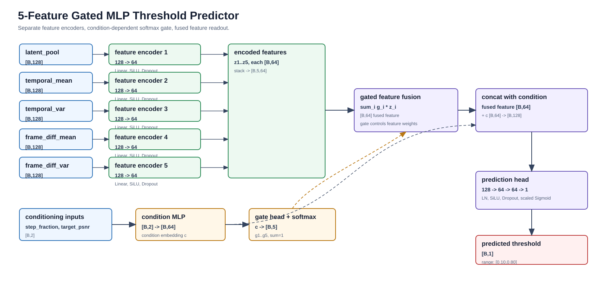

# 5-Feature Gated MLP Predictor Comprehensive Report

Date: 2026-06-30

## 1. Scope

This report summarizes the current 5-feature gated MLP adaptive SeaCache threshold predictor:

- architecture diagram and module parameter settings;
- training configuration and offline metrics for sample split, row split 30 epochs, and row split 100 epochs;
- training loss curves;
- online inference settings and real Wan2.2 T2V-14B performance on VBench10 and OpenVid100 train prompts;
- explicit 30-epoch vs 100-epoch training comparison.

The predictor output is a per-step SeaCache threshold constrained to `[0.10, 0.80]`:

```text
threshold = min_threshold + sigmoid(raw) * (max_threshold - min_threshold)
```

## 2. Architecture



### 2.1 High-Level Flow

```text
five pooled features, each [B, 128]
  -> independent per-feature MLP encoders
  -> five feature embeddings [B, 64]

condition [step_fraction, normalized_target_psnr]
  -> condition MLP
  -> condition embedding [B, 64]
  -> gate MLP + softmax
  -> feature gates [B, 5]

weighted sum of feature embeddings
  -> fused feature embedding [B, 64]

concat(fused feature, condition embedding) [B, 128]
  -> prediction head
  -> raw scalar logit
  -> scaled sigmoid threshold in [0.10, 0.80]
```

No raw multi-feature concatenation is used. The only concatenation is after gated fusion, when the single fused feature embedding is combined with the condition embedding for the final prediction head.

### 2.2 Input Features

| Feature | Tensor construction | Cached dim |
|---|---|---:|
| `latent_pool` | raw latent pooled to `[2,2,2]` | `128` |
| `temporal_mean` | temporal mean, expanded then pooled | `128` |
| `temporal_var` | temporal variance, expanded then pooled | `128` |
| `frame_diff_mean` | first-order absolute frame-difference mean, expanded then pooled | `128` |
| `frame_diff_var` | first-order absolute frame-difference variance, expanded then pooled | `128` |

Source latent shape is `[16, 12, 60, 104]`; pooled feature dim is `16 * 2 * 2 * 2 = 128`.

### 2.3 Module Settings

| Item | Value |
|---|---:|
| training model class | `CachedGatedFeatureAdaCacheGate` |
| online model type | `mlp_gated` |
| implementation | `adaptive_threshold_predictor/models.py`, `adaptive_seacache_wan22/cache.py` |
| number of features | `5` |
| per-feature input dim | `128` |
| hidden dim | `64` |
| feature embedding dim | `64` |
| condition input dim | `2` |
| condition embedding dim | `64` |
| gate output dim | `5` |
| activation | `SiLU` |
| dropout | `0.05` |
| condition input | `[step_fraction, normalized_target_psnr]` |
| PSNR normalization | `(target_psnr - 10) / (50 - 10)`, clamped to `[0,1]` |
| output mapping | `0.10 + sigmoid(raw) * 0.70` |

Per-feature encoder:

```text
Linear(128 -> 64)
SiLU
Dropout(0.05)
Linear(64 -> 64)
SiLU
```

Condition encoder:

```text
Linear(2 -> 64)
SiLU
Linear(64 -> 64)
SiLU
```

Gate head:

```text
Linear(64 -> 64)
SiLU
Linear(64 -> 5)
Softmax(dim=-1)
```

Prediction head:

```text
Linear(128 -> 64)
LayerNorm(64)
SiLU
Dropout(0.05)
Linear(64 -> 64)
SiLU
Linear(64 -> 1)
scaled Sigmoid to [0.10, 0.80]
```

### 2.4 Parameter Count

Total trainable parameters: `83,526`.

| Module | Parameters |
|---|---:|
| feature encoders total | `62,080` |
| each feature encoder | `12,416` |
| condition encoder | `4,352` |
| gate head | `4,485` |
| prediction head | `12,609` |
| total | `83,526` |

## 3. Training Setup

Three range-constrained 5-feature checkpoints were trained:

| Run | Split | Epoch budget | Min LR | Early-stop patience | Train / test sample IDs | Directory |
| --- | --- | --- | --- | --- | --- | --- |
| sample split 30 | sample | 30 | 1e-05 | 5 | 80 / 20 | /hy-tmp/wan22_adaptive_threshold_mlp_gated_5feature_range_samplesplit_20260630_035000 |
| row split 30 | row | 30 | 1e-05 | 5 | 100 / 100 | /hy-tmp/wan22_adaptive_threshold_mlp_gated_5feature_range_rowsplit_gpu_20260630_035000 |
| row split 100 | row | 100 | 1e-06 | 20 | 100 / 100 | /hy-tmp/wan22_adaptive_threshold_mlp_gated_5feature_range_rowsplit_gpu_long100_20260630_035000 |

### 3.1 Shared Training Parameters

| Item | Value |
| --- | --- |
| script | `python -m adaptive_threshold_predictor.train_gate` |
| dataset mode | `candidate_inverse` |
| model type | `mlp` with multi-feature gated fusion |
| feature sets | `latent_pool temporal_mean temporal_var frame_diff_mean frame_diff_var` |
| input mode | `cached_feature` from pooled feature cache |
| feature cache | `/hy-tmp/wan22_adaptive_threshold_feature_cache_candidate_inverse_20260616_012409` |
| examples | `50,000` |
| train fraction | `0.8` |
| batch size | `256` |
| optimizer LR | `0.0003` |
| warmup steps | `500` |
| weight decay | `0.0001` |
| loss | Smooth L1 |
| Smooth L1 beta | `0.02` |
| grad clip | `1.0` |
| dropout | `0.05` |
| split seed | `42` |
| threshold range | `[0.10, 0.80]` |
| PSNR normalization range | `[10, 50]` |

### 3.2 Offline Training Metrics

| Run | Split | Epochs run | Early stopped | Best epoch | Train loss | Train MAE | Test loss | Test MAE | Final test MAE |
| --- | --- | --- | --- | --- | --- | --- | --- | --- | --- |
| sample split 30 | sample | 14 / 30 | yes | 9 | `0.077537` | `0.086933` | `0.104928` | `0.114357` | `0.127830` |
| row split 30 | row | 30 / 30 | no | 30 | `0.068333` | `0.077565` | `0.067842` | `0.077050` | `0.077050` |
| row split 100 | row | 100 / 100 | no | 98 | `0.054622` | `0.063460` | `0.052242` | `0.061031` | `0.061050` |

Last-epoch metrics:

| Run | Last epoch | Train loss | Train MAE | Test loss | Test MAE | Test bias |
| --- | --- | --- | --- | --- | --- | --- |
| sample split 30 | 14 | `0.069780` | `0.079112` | `0.118275` | `0.127830` | `+0.017778` |
| row split 30 | 30 | `0.068333` | `0.077565` | `0.067842` | `0.077050` | `-0.002593` |
| row split 100 | 100 | `0.054636` | `0.063476` | `0.052258` | `0.061050` | `-0.001205` |

Mean validation/test gate weights from `val_predictions.csv`:

| Run | latent_pool | temporal_mean | temporal_var | frame_diff_mean | frame_diff_var |
| --- | --- | --- | --- | --- | --- |
| sample split 30 | `0.5464` | `0.1839` | `0.0945` | `0.0986` | `0.0766` |
| row split 30 | `0.4781` | `0.1967` | `0.1267` | `0.0998` | `0.0987` |
| row split 100 | `0.3987` | `0.2533` | `0.0942` | `0.0962` | `0.1576` |

## 4. Training Loss Curves

Train and test/validation Smooth L1 loss are overlaid within each run. The three runs are separated into subplots because sample split early-stopped after 14 epochs, row split 30 ran for 30 epochs, and row split 100 ran for 100 epochs.


## 5. 30-Epoch vs 100-Epoch Training Comparison

The clearest epoch-budget comparison is row split, because both 30-epoch and 100-epoch row-split runs use the same split mode and dataset type.

| Run | Epoch budget | Compared epoch | Test loss | Test MAE | Train MAE |
| --- | --- | --- | --- | --- | --- |
| row split 30 run | 30 | 30 | `0.067842` | `0.077050` | `0.077565` |
| row split 100 run at epoch 30 | 100 | 30 | `0.065279` | `0.074371` | `0.073937` |
| row split 100 best | 100 | 98 | `0.052242` | `0.061031` | `0.063460` |

The row-split 100-epoch run improves from epoch 30 test MAE `0.074371` to best test MAE `0.061031` at epoch 98. Relative to the independent row-split 30-epoch run best MAE `0.077050`, the 100-epoch best is better by `20.8%`.

The sample-split run does not show the same benefit from longer training in this configuration: it early-stopped at 14 epochs, with best test MAE at epoch 9. This indicates overfitting under sample-level generalization while row split still benefits from longer interpolation training.

## 6. Online Inference Settings

Online inference used the same Wan2.2 T2V-14B generation defaults and the same 24-candidate protocol as the MiniDiT split comparison.

| Item | Value |
|---|---:|
| task | `t2v-A14B` |
| checkpoint | `/hy-tmp/models/Wan2.2-T2V-A14B` |
| size | `832*480` |
| frame count | `45` |
| sample steps | `50` |
| solver | `dpm++` |
| seed | `42` |
| offload | enabled |
| model dtype conversion | enabled |
| baseline policy | reuse existing no-cache baseline |
| quality metric | FFmpeg PSNR against same prompt/seed/shape baseline |
| speed metric | `inference_compute_elapsed_seconds` |
| runner | `experiments/adaptive_seacache_mini_dit_split_compare_50step_45f_480p/run_batch.py` |
| online adaptive model type | `mlp_gated` auto-detected from `fusion.*` checkpoint keys |
| threshold clamp | `[0.10, 0.80]` |
| result root | `/hy-tmp/wan22_adaptive_seacache_mlp_gated_5feature_range_split_compare_50step_45f_480p_20260630_050727` |

Candidate grid:

```text
2 splits * 2 target PSNRs * 2 datasets * 3 prompts = 24 candidates
```

| Axis | Values |
|---|---|
| model split | `sample_split`, `row_split` |
| target PSNR | `22`, `28` |
| VBench10 prompts | `vbench10_001`, `vbench10_002`, `vbench10_003` |
| OpenVid train prompts | `openvid_002`, `openvid_004`, `openvid_005` |

Online checkpoints:

| Split | Checkpoint |
|---|---|
| sample split | `/hy-tmp/wan22_adaptive_threshold_mlp_gated_5feature_range_samplesplit_20260630_035000/best_model_checkpoint.pt` |
| row split | `/hy-tmp/wan22_adaptive_threshold_mlp_gated_5feature_range_rowsplit_gpu_long100_20260630_035000/best_model_checkpoint.pt` |

Batch-runner behavior:

- one WanT2V pipeline load for the whole run;
- baseline videos reused, not regenerated;
- one fresh adaptive SeaCache factory per candidate;
- cache runtime state cleared after each candidate;
- `wan.text2video.SeaCacheTimestepCache` restored after each candidate;
- `torch.cuda.empty_cache()` called after cleanup.

The online result table includes `predictor_call_count`, but this run recorded `0` calls and blank predictor elapsed fields. Therefore predictor overhead is not reported here; online performance is based on T2V compute elapsed time and PSNR.

## 7. Online Results: Per Prompt

| dataset | prompt | split | target | speedup | PSNR | target error | reuse | threshold mean |
| --- | --- | --- | --- | --- | --- | --- | --- | --- |
| vbench10 | vbench10_001 | sample_split | 22 | 2.031x | 15.340 | -6.660 | 54 | 0.301 |
| vbench10 | vbench10_001 | sample_split | 28 | 1.497x | 21.195 | -6.805 | 34 | 0.173 |
| vbench10 | vbench10_001 | row_split | 22 | 1.965x | 19.906 | -2.094 | 52 | 0.293 |
| vbench10 | vbench10_001 | row_split | 28 | 1.672x | 20.314 | -7.686 | 42 | 0.208 |
| vbench10 | vbench10_002 | sample_split | 22 | 2.501x | 20.878 | -1.122 | 64 | 0.423 |
| vbench10 | vbench10_002 | sample_split | 28 | 1.582x | 32.047 | +4.047 | 38 | 0.192 |
| vbench10 | vbench10_002 | row_split | 22 | 2.745x | 20.815 | -1.185 | 68 | 0.533 |
| vbench10 | vbench10_002 | row_split | 28 | 1.844x | 30.000 | +2.000 | 48 | 0.239 |
| vbench10 | vbench10_003 | sample_split | 22 | 2.204x | 15.259 | -6.741 | 58 | 0.350 |
| vbench10 | vbench10_003 | sample_split | 28 | 1.539x | 23.137 | -4.863 | 36 | 0.187 |
| vbench10 | vbench10_003 | row_split | 22 | 1.726x | 21.708 | -0.292 | 44 | 0.233 |
| vbench10 | vbench10_003 | row_split | 28 | 1.422x | 23.139 | -4.861 | 30 | 0.157 |
| openvid100_train | openvid_002 | sample_split | 22 | 2.379x | 22.844 | +0.844 | 62 | 0.415 |
| openvid100_train | openvid_002 | sample_split | 28 | 1.490x | 29.690 | +1.690 | 34 | 0.169 |
| openvid100_train | openvid_002 | row_split | 22 | 2.282x | 20.637 | -1.363 | 60 | 0.371 |
| openvid100_train | openvid_002 | row_split | 28 | 1.532x | 28.916 | +0.916 | 36 | 0.193 |
| openvid100_train | openvid_004 | sample_split | 22 | 3.019x | 24.290 | +2.290 | 72 | 0.688 |
| openvid100_train | openvid_004 | sample_split | 28 | 2.598x | 27.842 | -0.158 | 66 | 0.539 |
| openvid100_train | openvid_004 | row_split | 22 | 3.200x | 22.975 | +0.975 | 74 | 0.741 |
| openvid100_train | openvid_004 | row_split | 28 | 2.728x | 24.810 | -3.190 | 68 | 0.473 |
| openvid100_train | openvid_005 | sample_split | 22 | 2.378x | 21.439 | -0.561 | 62 | 0.382 |
| openvid100_train | openvid_005 | sample_split | 28 | 1.448x | 24.563 | -3.437 | 32 | 0.165 |
| openvid100_train | openvid_005 | row_split | 22 | 2.283x | 22.299 | +0.299 | 60 | 0.352 |
| openvid100_train | openvid_005 | row_split | 28 | 1.487x | 24.560 | -3.440 | 34 | 0.172 |

## 8. Online Results: Aggregate

| dataset | split | target | n | speedup | mean PSNR | target error | mean reuse | mean threshold |
| --- | --- | --- | --- | --- | --- | --- | --- | --- |
| openvid100_train | row_split | 22 | 3 | 2.523x | 21.970 | -0.030 | 64.7 | 0.488 |
| openvid100_train | row_split | 28 | 3 | 1.773x | 26.095 | -1.905 | 46.0 | 0.279 |
| openvid100_train | sample_split | 22 | 3 | 2.559x | 22.858 | +0.858 | 65.3 | 0.495 |
| openvid100_train | sample_split | 28 | 3 | 1.718x | 27.365 | -0.635 | 44.0 | 0.291 |
| vbench10 | row_split | 22 | 3 | 2.065x | 20.810 | -1.190 | 54.7 | 0.353 |
| vbench10 | row_split | 28 | 3 | 1.627x | 24.484 | -3.516 | 40.0 | 0.201 |
| vbench10 | sample_split | 22 | 3 | 2.229x | 17.159 | -4.841 | 58.7 | 0.358 |
| vbench10 | sample_split | 28 | 3 | 1.539x | 25.460 | -2.540 | 36.0 | 0.184 |


## 9. Findings

1. The 5-feature gated MLP has a much smaller parameter count than MiniDiT (`83,526` vs `724,513`) and can be used online after extracting five pooled latent summary features at each SeaCache decision step.

2. Offline row split is much easier than sample split. The best test MAE improves from sample split `0.114357` to row split 100 `0.061031`, but row split shares source-video identity between train and test rows and should not be treated as sample-level generalization.

3. Longer row-split training matters. The 100-epoch row-split best test MAE `0.061031` is materially better than the 30-epoch row-split best `0.077050`. The sample-split run instead early-stops, indicating overfitting under held-out-sample validation.

4. Online performance varies strongly by dataset, prompt, and target PSNR. OpenVid train target control is much better than VBench10 target control in this 3-prompt pilot.

5. Target control remains weak on VBench10. The 5-feature MLP undershoots VBench10 target 22 under both splits and also undershoots VBench10 target 28 on average. This suggests that the `candidate_inverse` training objective and online adaptive threshold control remain mismatched.

6. The online MLP thresholds are strongly target-dependent: target 22 usually predicts larger thresholds and yields higher reuse/speedup, while target 28 predicts lower thresholds and yields lower reuse but higher quality.

## 10. Artifacts

| Artifact | Path |
|---|---|
| architecture diagram | `reports/assets/gated_multifeature_mlp_architecture.svg` |
| training loss curves | `reports/assets/gated_multifeature_mlp_training_loss_curves.svg` |
| architecture proposal/reference | `reports/report_gated_multifeature_mlp_architecture.md` |
| sample-split training dir | `/hy-tmp/wan22_adaptive_threshold_mlp_gated_5feature_range_samplesplit_20260630_035000` |
| row-split 30 training dir | `/hy-tmp/wan22_adaptive_threshold_mlp_gated_5feature_range_rowsplit_gpu_20260630_035000` |
| row-split 100 training dir | `/hy-tmp/wan22_adaptive_threshold_mlp_gated_5feature_range_rowsplit_gpu_long100_20260630_035000` |
| online inference result root | `/hy-tmp/wan22_adaptive_seacache_mlp_gated_5feature_range_split_compare_50step_45f_480p_20260630_050727` |
| online summary CSV | `/hy-tmp/wan22_adaptive_seacache_mlp_gated_5feature_range_split_compare_50step_45f_480p_20260630_050727/results/summary.csv` |
| online aggregate CSV | `/hy-tmp/wan22_adaptive_seacache_mlp_gated_5feature_range_split_compare_50step_45f_480p_20260630_050727/results/aggregate_by_dataset_model_target.csv` |
| dedicated MiniDiT vs 5-feature comparison report | `reports/report_adaptive_predictor_mini_dit_vs_gated_mlp_comparison_20260630.md` |
