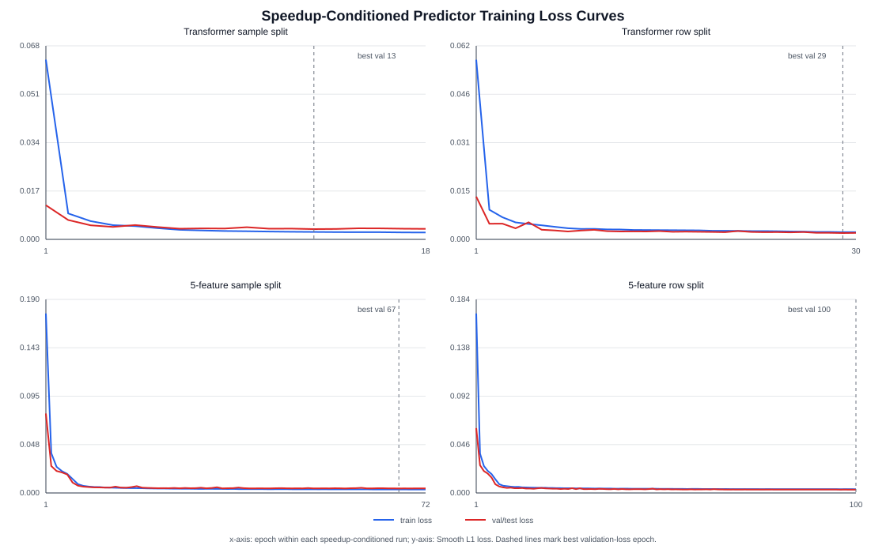

# Predictor Speedup-Conditioned Report

Date: 2026-07-06

## 1. How Speedup Was Added

原 predictor 的条件输入是 `[step_fraction, normalized_target_psnr]`。加入 speedup 后，只把条件向量扩展为 `[step_fraction, normalized_target_psnr, normalized_target_speedup]`；Transformer/MiniDiT 的 latent tokenization、Transformer blocks、CLS readout，以及 5-feature gated MLP 的五路特征编码和 gate 结构都不变。

对应参数量只因 condition MLP 第一层输入维度 `2 -> 3` 小幅增加：

| Architecture | Original params | Speedup-conditioned params | Delta |
|---|---:|---:|---:|
| Transformer / MiniDiT-CLS | `724,513` | `724,609` | `+96` |
| 5-feature gated MLP | `83,526` | `83,590` | `+64` |

## 2. Training Curves And Offline Loss



图中每个面板只画 speedup-conditioned 版本的 Smooth L1 loss：蓝线是 train loss，红线是 validation/test loss；虚线标记 best validation-loss epoch。原版无 speedup 条件的 loss 不叠加进图里，但训练结果表必须和原版做数值对比。speedup-conditioned 离线 inverse task 明显更容易，因为训练标签来自固定 SeaCache 候选，`target_speedup` 直接提供了候选运行点的强约束。

Paired best-loss comparison:

| Architecture | Split | Original val/test loss | Speedup val/test loss | Loss reduction | Original MAE | Speedup MAE | MAE reduction |
|---|---|---:|---:|---:|---:|---:|---:|
| Transformer | sample | `0.105273` | `0.003623` | `29.1x` | `0.114459` | `0.005919` | `19.3x` |
| Transformer | row | `0.030339` | `0.002029` | `15.0x` | `0.038002` | `0.003840` | `9.9x` |
| 5-feature | sample | `0.104928` | `0.004435` | `23.7x` | `0.114357` | `0.008730` | `13.1x` |
| 5-feature | row | `0.052240` | `0.003195` | `16.4x` | `0.061034` | `0.007145` | `8.5x` |

Full best-epoch metrics:

| Architecture | Split | Version | Epochs | Best loss epoch | Train loss | Val/test loss | Val/test MAE |
|---|---|---|---:|---:|---:|---:|---:|
| Transformer | sample | original | 9 | 4 | `0.067382` | `0.105273` | `0.114459` |
| Transformer | row | original | 30 | 29 | `0.032757` | `0.030339` | `0.038002` |
| Transformer | sample | speedup | 18 | 13 | `0.002609` | `0.003623` | `0.005919` |
| Transformer | row | speedup | 30 | 29 | `0.002310` | `0.002029` | `0.003840` |
| 5-feature | sample | original | 14 | 9 | `0.077537` | `0.104928` | `0.114357` |
| 5-feature | row | original | 100 | 97 | `0.054433` | `0.052240` | `0.061034` |
| 5-feature | sample | speedup | 72 | 67 | `0.003475` | `0.004435` | `0.008730` |
| 5-feature | row | speedup | 100 | 100 | `0.003571` | `0.003195` | `0.007145` |

Notes:

- 这里的 `sample` split 是按 sample/video 分组切分；`row` split 是随机行切分，同一个 sample 可同时出现在 train/test，因此 row split 更像插值能力测试。
- 5-feature 原版 row split 使用 100-epoch run，和 speedup-conditioned 100-epoch row split 对齐。
- Transformer speedup row split 的最低 validation loss 在 epoch `29`；最低 MAE 在 epoch `30`，MAE 为 `0.003765`。

### 2.1 Condition-Only Ablations

为确认收益是否主要来自 `target_speedup` 条件，又做了两个 row-split condition-only baseline。两者都不输入 latent 或 cached features，只用条件 MLP 输出 threshold：

| Ablation | Inputs | Params | Epochs | Best loss epoch | Train loss | Val/test loss | Best MAE epoch | Val/test MAE |
|---|---|---:|---:|---:|---:|---:|---:|---:|
| Condition-only full | `timestep + target_psnr + target_speedup` | `12,929` | 80 | 78 | `0.003491` | `0.003459` | 60 | `0.007347` |
| Condition-only speedup-only | `timestep + target_speedup` | `12,865` | 100 | 100 | `0.003562` | `0.003551` | 85 | `0.007612` |

Result: condition-only full already matches the speedup-conditioned 5-feature row-split scale (`MAE 0.007347` vs `0.007119`), and speedup-only remains almost identical (`MAE 0.007612`). This indicates most offline inverse-task gain comes from `target_speedup`; in this dataset, speedup nearly determines the threshold.

## 3. Transformer Online Inference Results

Online inference uses Wan2.2 T2V-14B, `832*480`, `45` frames, `50` DPM++ steps, seed `42`, compute-only elapsed time for speedup, and FFmpeg PSNR against same prompt/seed/shape no-cache baseline.

The original Transformer table is from:

```text
/hy-tmp/wan22_adaptive_seacache_mini_dit_split_compare_50step_45f_480p_20260630_025328/results/aggregate_by_dataset_model_target.csv
```

The speedup-conditioned Transformer table is from:

```text
/hy-tmp/wan22_adaptive_seacache_mini_dit_rowsplit_speedup_sweep_50step_45f_480p_20260706_194715/results/aggregate_by_dataset_model_target.csv
```

Direct comparison below uses the `row_split` Transformer checkpoint because the speedup-conditioned online sweep only ran row split. The old sample-split Transformer results are not mixed into this table.

| Version | Dataset | Target PSNR | Target speedup | N | Overall speedup | Mean PSNR | PSNR error | Mean reuse | Mean threshold |
|---|---|---:|---:|---:|---:|---:|---:|---:|---:|
| original | openvid100_train | `22` | - | 3 | `2.447x` | `23.007` | `+1.007` | `63.3` | `0.484` |
| speedup | openvid100_train | `22` | `2.2` | 3 | `2.238x` | `24.111` | `+2.111` | `60.0` | `0.362` |
| speedup | openvid100_train | `22` | `2.5` | 3 | `2.401x` | `22.562` | `+0.562` | `63.3` | `0.431` |
| speedup | openvid100_train | `22` | `2.8` | 3 | `2.675x` | `22.504` | `+0.504` | `68.0` | `0.500` |
| original | openvid100_train | `28` | - | 3 | `1.633x` | `27.710` | `-0.290` | `40.7` | `0.232` |
| speedup | openvid100_train | `28` | `1.4` | 3 | `1.398x` | `31.652` | `+3.652` | `30.7` | `0.146` |
| speedup | openvid100_train | `28` | `1.7` | 3 | `1.685x` | `27.405` | `-0.595` | `44.0` | `0.218` |
| speedup | openvid100_train | `28` | `2.0` | 3 | `2.043x` | `25.455` | `-2.545` | `55.3` | `0.308` |
| original | vbench10 | `22` | - | 3 | `2.068x` | `20.466` | `-1.534` | `54.7` | `0.329` |
| speedup | vbench10 | `22` | `2.2` | 3 | `2.264x` | `19.146` | `-2.854` | `60.0` | `0.358` |
| speedup | vbench10 | `22` | `2.5` | 3 | `2.352x` | `17.198` | `-4.802` | `62.0` | `0.430` |
| speedup | vbench10 | `22` | `2.8` | 3 | `2.709x` | `17.358` | `-4.642` | `68.0` | `0.500` |
| original | vbench10 | `28` | - | 3 | `1.539x` | `25.469` | `-2.531` | `36.0` | `0.178` |
| speedup | vbench10 | `28` | `1.4` | 3 | `1.401x` | `27.930` | `-0.070` | `30.0` | `0.147` |
| speedup | vbench10 | `28` | `1.7` | 3 | `1.666x` | `23.581` | `-4.419` | `42.7` | `0.216` |
| speedup | vbench10 | `28` | `2.0` | 3 | `2.067x` | `18.652` | `-9.348` | `55.3` | `0.309` |

### 3.1 Online Trace Check

The 36 online traces contain `3,600` predictor calls. A categorical mean using only `target_speedup` explains almost all predicted-threshold variance:

| Predictor threshold explained by | R2 |
|---|---:|
| `target_speedup` | `0.999404` |
| `target_speedup + step` | `0.999557` |
| `target_speedup + sample_id` | `0.999601` |

Mean predicted threshold by target speedup:

| Target speedup | Mean predicted threshold | Candidate-mean range |
|---:|---:|---:|
| `1.4` | `0.146937` | `0.001699` |
| `1.7` | `0.216816` | `0.003281` |
| `2.0` | `0.308385` | `0.001680` |
| `2.2` | `0.359909` | `0.009961` |
| `2.5` | `0.430332` | `0.004414` |
| `2.8` | `0.499831` | `0.004258` |

Conclusion: the online Transformer predictor is effectively learning a `target_speedup -> threshold` mapping. Prompt and step add only tiny residual variation.

## 4. Readout

Offline loss improves by more than an order of magnitude for both architectures after adding `target_speedup`, but this should not be read as online deployment success by itself.

Online Transformer row-split behavior is interpretable:

- increasing target speedup usually raises mean threshold/reuse and increases actual speedup;
- on OpenVid100 train, `target_psnr=22` remains near or above target across `2.2-2.8x`;
- on VBench10, aggressive target speedup causes substantial PSNR undershoot, especially at target PSNR `28`;
- for VBench10 target PSNR `28`, the speedup-conditioned `target_speedup=1.4` point is the best calibrated point in this table: `1.401x`, `27.930 dB`, PSNR error `-0.070 dB`.

Conclusion: adding speedup is useful as a control input and makes offline candidate inversion much easier, but online target control still depends strongly on dataset/domain and target-speedup choice. The current speedup-conditioned Transformer improves controllability, not universally the quality-speed Pareto frontier.
