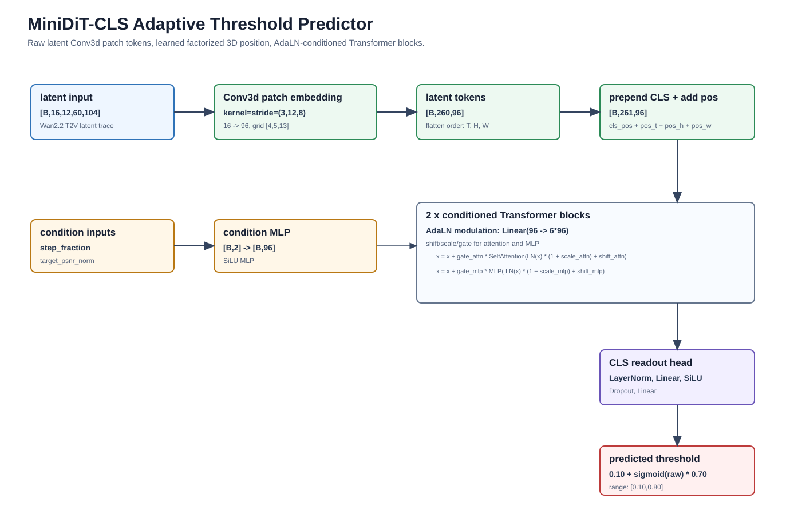

# Transformer Threshold Predictor Architecture Proposal

Date: 2026-06-29



## 1. Objective

This document defines the first Transformer-based adaptive threshold predictor for Wan2.2 T2V SeaCache-style inference acceleration.

The goal is not to reproduce the full Wan2.2 DiT backbone. The goal is to keep the parts that matter for threshold prediction:

- latent-to-token conversion with 3D video structure,
- lightweight Transformer blocks over video latent tokens,
- target-quality and denoising-step conditioning,
- a global scalar threshold output.

The current adaptive predictor is a small pooled-feature MLP. It uses heavily compressed latent features, commonly `2x2x2` pooled features, and predicts one threshold per denoising step. The proposed architecture is intended to preserve more spatiotemporal information while keeping the model small enough for online inference.

## 2. Data Constraint

The current training set has roughly 40k training examples after sample-level train/validation split.

Important caveat: these are not 40k independent videos. They are step-level examples derived from a much smaller number of prompt/video trajectories:

```text
samples x threshold candidates x denoising steps
```

Therefore, the effective data diversity is much smaller than the raw row count. The first Transformer predictor should be deliberately small and regularized. A large DiT-like model may reduce training loss but is likely to overfit prompt/sample-specific latent statistics.

## 3. Wan2.2 Reference Tokenization

Wan2.2 T2V-A14B receives latent tensors shaped:

```text
[C, F, H, W] = [16, 12, 60, 104]
```

for the current default experiment setting:

```text
frame_num = 45
size = 832x480
vae_stride = (4, 8, 8)
```

The Wan2.2 DiT patchifies these latents with:

```text
patch_size = (1, 2, 2)
Conv3d(16 -> 5120, kernel=(1,2,2), stride=(1,2,2))
```

This produces:

```text
grid = [12, 30, 52]
token_count = 12 * 30 * 52 = 18,720
token_dim = 5120
```

That scale is not appropriate for an online threshold predictor. The predictor should borrow the design idea, not the scale.

## 4. Proposed Architecture

Recommended model name:

```text
MiniDiTCLSAdaptiveThresholdPredictor
```

High-level flow:

```text
latent [B, 16, 12, 60, 104]
  -> Conv3d patch embedding
  -> latent tokens [B, 260, 96]
  -> prepend CLS token
  -> add factorized 3D positional embedding
  -> 2 lightweight conditioned Transformer blocks
  -> CLS readout
  -> scalar threshold in [0.10, 0.80]
```

## 5. Hyperparameters

Recommended first-run hyperparameters:

| Item | Value |
|---|---:|
| input latent channels | `16` |
| input latent shape | `[16, 12, 60, 104]` |
| patch size | `(3, 12, 8)` |
| patch embedding | `Conv3d(16, 96, kernel_size=(3,12,8), stride=(3,12,8))` |
| token grid | `[4, 5, 13]` |
| latent token count | `260` |
| readout token | `CLS` |
| model dim | `96` |
| transformer layers | `2` |
| attention heads | `4` |
| head dim | `24` |
| MLP ratio | `2.0` |
| MLP hidden dim | `192` |
| activation | `GELU` or `SiLU`; prefer `GELU` for Transformer MLP |
| normalization | `LayerNorm` |
| attention dropout | `0.05` |
| MLP/dropout | `0.05` |
| stochastic depth | `0.0` for first run |
| output range | `[0.10, 0.80]` |
| output activation | `threshold = 0.10 + sigmoid(raw) * 0.70` |

Rationale:

- `patch_size=(3,12,8)` reduces token count to `260`, which keeps attention cheap.
- `d_model=96` is intentionally smaller than the previously discussed `128` because the training set has only about 40k step examples with substantial correlation.
- `2` layers are enough for the first experiment to test whether latent token modeling helps over pooled-feature MLPs.
- `4` heads keep attention stable while preserving a reasonable per-head width of `24`.
- Dropout `0.05` is included to reduce overfitting without making optimization noisy.

Optional second-run capacity increase if the first model underfits:

| Item | Value |
|---|---:|
| model dim | `128` |
| transformer layers | `2` |
| attention heads | `4` |
| MLP ratio | `2.0` |
| token grid | unchanged `[4,5,13]` |

Do not increase both token count and model width in the same first ablation. If the `96`-dim model underfits, increase `d_model` first. If the model fits training data but misses quality control in inference, changing token resolution is a separate experiment.

## 6. Patch Tokenization Details

Input latent:

```text
[B, 16, 12, 60, 104]
```

Patch embedding:

```text
kernel = stride = (3, 12, 8)
```

Output grid:

```text
F_patch = 12 / 3 = 4
H_patch = 60 / 12 = 5
W_patch = 104 / 8 = 13
```

Token count:

```text
L = 4 * 5 * 13 = 260
```

Patch embedding output:

```text
[B, 96, 4, 5, 13]
```

Flattened token sequence:

```text
[B, 260, 96]
```

After prepending CLS:

```text
[B, 261, 96]
```

The flattening order should follow Wan/PyTorch convention:

```text
for f in range(F_patch):
  for h in range(H_patch):
    for w in range(W_patch):
      token_index = (f * H_patch + h) * W_patch + w
```

## 7. Positional Encoding

The first implementation does not need to exactly reproduce Wan2.2 3D RoPE. Use factorized learned 3D positional embeddings:

```text
pos_t: [F_patch, d_model]
pos_h: [H_patch, d_model]
pos_w: [W_patch, d_model]
pos_grid[f,h,w] = pos_t[f] + pos_h[h] + pos_w[w]
```

Then:

```text
latent_tokens = latent_tokens + pos_grid.flatten(0, 2)
cls_token = cls_token + cls_pos
```

Reasons for this choice:

- It preserves explicit 3D video structure.
- It is simpler than implementing a separate 3D RoPE attention path.
- The grid is fixed for the current experiment shape, so learned factorized position embeddings are sufficient.
- It keeps the architecture easy to debug before adding more Wan-like complexity.

If later experiments show the model is sensitive to resolution or shape changes, replace this with 3D RoPE or interpolation-capable factorized embeddings.

## 8. Conditioning Design

Condition inputs:

```text
step_fraction: step_index / (num_steps - 1)
target_psnr_norm: clamp((target_psnr - 10.0) / 40.0, 0, 1)
```

Condition vector:

```text
cond_input = [step_fraction, target_psnr_norm]
cond_embed = MLP(2 -> 96 -> 96)
```

Use DiT-style adaptive LayerNorm modulation in every block:

```text
cond_embed -> Linear(96 -> 6 * 96)
```

Split into:

```text
shift_attn, scale_attn, gate_attn,
shift_mlp,  scale_mlp,  gate_mlp
```

Block equations:

```text
x_attn = LN(x) * (1 + scale_attn) + shift_attn
x = x + gate_attn * SelfAttention(x_attn)

x_mlp = LN(x) * (1 + scale_mlp) + shift_mlp
x = x + gate_mlp * MLP(x_mlp)
```

Recommended initialization:

- Initialize the final modulation projection weight and bias to zero.
- This makes each block start close to an unconditioned residual block and usually stabilizes early training.

The condition should modulate both CLS and latent tokens. This allows the same latent state to produce different thresholds for different quality targets.

## 9. Readout And Output

Use CLS readout:

```text
cls = x[:, 0]
raw = head(LayerNorm(cls))
threshold = 0.10 + sigmoid(raw) * 0.70
```

Recommended head:

```text
LayerNorm(96)
Linear(96, 96)
SiLU()
Dropout(0.05)
Linear(96, 1)
```

The explicit threshold range is important. Current SeaCache training labels are in:

```text
[0.10, 0.80]
```

The old MLP uses a sigmoid output in `[0, 1]`, which allows predictions outside the training support. For this predictor, constrain output to the observed threshold range unless a later experiment deliberately extends the sweep.

## 10. Estimated Parameter Scale

Approximate parameter count for the recommended first-run configuration:

| Component | Approx params |
|---|---:|
| Conv3d patch embedding | `~442k` |
| CLS + factorized position embeddings | `<3k` |
| condition MLP | `~10k` |
| 2 Transformer blocks, attention + MLP | `~150k` |
| 2 Transformer blocks, AdaLN modulation | `~112k` |
| output head | `~10k` |
| total | `~725k` |

This is much larger than the current ~29k MLP predictor, but still small compared with Wan2.2. Given the limited effective sample diversity, this should be treated as the upper end of the first safe architecture, not a starting point for further scaling.

## 11. Training Hyperparameters

Recommended first training run:

| Item | Value |
|---|---:|
| optimizer | `AdamW` |
| learning rate | `3e-4` |
| weight decay | `1e-4` |
| batch size | `64` if using cached/grid features; otherwise as large as memory allows |
| epochs | `30` maximum |
| early stopping | patience `5` on validation MAE/loss |
| loss | `SmoothL1Loss(beta=0.02)` or PyTorch default SmoothL1 if beta is not wired |
| gradient clipping | `1.0` |
| mixed precision | allowed for training speed, keep loss in fp32 |
| train/val split | group by `sample_id`, no sample overlap |
| seed | `42` |

Validation should report at least:

```text
val_loss
val_mae_threshold
prediction min / max / mean
per-target PSNR bucket MAE if available
per-step MAE curve
```

Because the final goal is online inference, offline loss is not sufficient. The trained checkpoint should be evaluated in the adaptive SeaCache inference loop on VBench10.

## 12. Ablation Plan

Minimal ablation matrix:

| Model | Purpose |
|---|---|
| current MLP predictor | baseline |
| MiniDiT-CLS `d=96`, 2 layers, patch `(3,12,8)` | first Transformer candidate |
| MiniDiT-CLS `d=128`, 2 layers, patch `(3,12,8)` | capacity check |
| MiniDiT-CLS `d=96`, 2 layers, patch `(2,8,8)` | token-resolution check, only if overhead allows |

Do not start with the `(2,8,8)` version as the default. It produces:

```text
grid = [6, 8, 13]
tokens = 624
```

which is more expensive and more likely to overfit with the current data scale.

## 13. Implementation Notes

Recommended implementation path:

1. Add a new model class in `adaptive_threshold_predictor/models.py`.
2. Add a dataset/cache path that stores grid features rather than only flattened `2x2x2` pooled features.
3. Keep the current MLP predictor unchanged for baseline comparison.
4. Add CLI options:

```text
--model_type mlp|mini_dit_cls
--dit_patch_size 3 12 8
--dit_dim 96
--dit_layers 2
--dit_heads 4
--dit_mlp_ratio 2.0
--dit_dropout 0.05
--min_threshold 0.10
--max_threshold 0.80
```

5. Save model config into checkpoint metadata, because online adaptive inference must reconstruct the exact predictor architecture.

## 14. Recommended First Configuration

Use this as the default for the first implementation:

```text
model_type = mini_dit_cls
patch_size = (3, 12, 8)
d_model = 96
num_layers = 2
num_heads = 4
mlp_ratio = 2.0
dropout = 0.05
position = factorized_learned_3d
conditioning = adaln_modulation
readout = cls
threshold_range = [0.10, 0.80]
optimizer = AdamW
lr = 3e-4
weight_decay = 1e-4
epochs = 30
early_stop_patience = 5
grad_clip = 1.0
```

This configuration is the best balance for the current situation: it is meaningfully more expressive than the pooled-feature MLP, but small enough for approximately 40k correlated step-level training examples and cheap enough to test in the online adaptive cache path.

## 15. Implementation Update

The implemented `mini_dit_cls` training path now follows the Conv3d patch-embedding design in this report.

Current implemented input path:

```text
latent [B,16,12,60,104]
  -> Conv3d(16, d_model, kernel_size=(3,12,8), stride=(3,12,8))
  -> patch grid [4,5,13]
  -> 260 latent tokens
  -> prepend CLS
  -> factorized learned 3D positional embeddings
  -> conditioned Transformer blocks
  -> CLS threshold head
```

The checkpoint metadata records the feature extractor configuration:

```text
type = learned_conv3d_patch_embedding
input_shape = [16, 12, 60, 104]
patch_size = [3, 12, 8]
token_grid_shape = [4, 5, 13]
token_count = 260
```

An earlier lightweight implementation used fixed `avg_pool3d` grid features followed by a per-token linear projection. That path is no longer the recommended MiniDiT implementation. The fixed grid cache code remains available for other experiments, but the report recommendation and the `mini_dit_cls` model now use learned Conv3d patch embedding directly from raw traced latents.
